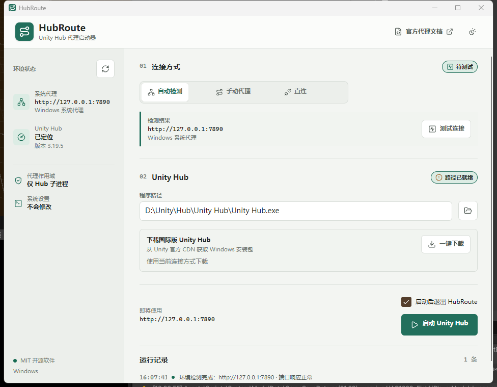
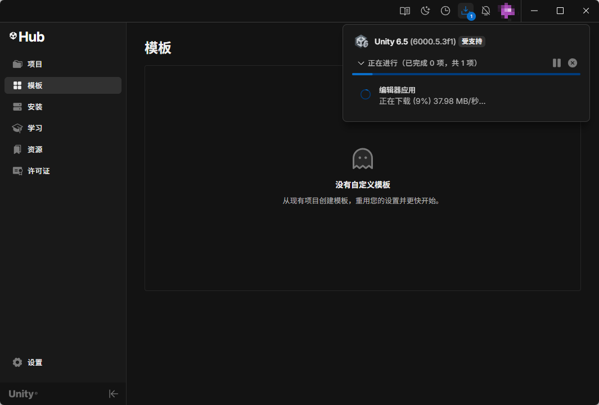

# HubRoute - Unity Hub 国际版下载与启动工具

HubRoute 是一款轻量、开源、跨平台的 Unity Hub 工具，可在默认浏览器中打开对应平台的国际版 Unity Hub 官方下载地址，并通过已有本地 HTTP 代理启动 Hub。由 Hub 打开的 Unity Editor、Unity Package Manager 和 Git HTTPS 通常也会继承相同代理，改善 Unity 国际服务连接与编辑器下载体验。

[下载最新稳定版](https://github.com/HinataYoki/Unity_HubRoute/releases/latest) | [查看平台支持](#平台支持) | [使用说明](#使用方式)

> 当前稳定版：0.1.1。HubRoute 不是代理软件，不提供代理节点或网络隧道；使用代理模式前需要已有可用的本地或企业 HTTP 代理。

## Unity Hub 国际版下载与使用

HubRoute 可以自动选择与操作系统及 CPU 架构匹配的官方国际版 Unity Hub 下载地址，并在默认浏览器中打开。安装并通过 HubRoute 启动 Unity Hub 后，可以访问 Unity 国际服务并下载 Unity Editor。下图为 Unity Hub 正在下载 Unity 6.5 编辑器：

HubRoute 注入的 HTTP_PROXY / HTTPS_PROXY 会沿操作系统的子进程环境继承：

~~~text
HubRoute -> Unity Hub -> Unity Editor -> Unity Package Manager -> Git (HTTPS)
~~~

因此，从 HubRoute 启动的 Unity Hub 再打开 Unity Editor 时，Editor、Unity Package Manager 及其调用的 Git 进程通常也会使用相同代理，可改善通过 HTTPS 下载包和拉取 Git 依赖的连通性。该作用域不包含已经运行的 Hub/Editor、通过 VCC 或快捷方式直接打开的 Editor，也不适用于 SSH Git 地址；实际效果仍取决于 Unity 版本、代理规则和网络环境。

## 功能

- 自动读取 Windows、macOS 和 Linux 的显式系统代理。
- 探测常见本地 HTTP 代理端口，也支持手动填写代理地址。
- 仅向 Unity Hub 子进程注入 HTTP_PROXY / HTTPS_PROXY，不修改系统全局设置。
- 启动前自动关闭已经运行的 Unity Hub，再以所选代理环境启动新实例。
- 自动定位常见路径中的 Unity Hub，并支持手动选择程序。
- 根据当前操作系统和 CPU 架构，在默认浏览器中打开对应的 Windows 或 macOS 国际版 Unity Hub 官方下载地址。
- 提供自动代理、手动代理和直连三种模式。

## 重要前提

HubRoute **不是代理软件，也不提供代理节点或网络隧道**。使用自动或手动代理模式前，必须先启动 Clash、Mihomo、V2Ray 等本地代理，或确保企业代理已经可用。

HubRoute 的端口测试只确认代理端口可连接，不代表 Unity 的登录、许可证和下载接口一定可用。最终连通性仍取决于代理规则、节点和网络环境。

为确保代理变量能够注入，点击“启动 Unity Hub”时会自动关闭已运行的 Unity Hub 及其 Helper 进程，但不会关闭 Unity Editor。检测到 Editor 正在运行时，HubRoute 会先提醒现有 Editor 无法继承新代理，并由用户选择取消或继续。已经打开的 Editor 需要保存并关闭，再从重新启动后的 Hub 打开才能继承代理。

## 平台支持

| 平台 | 启动 Unity Hub | 浏览器下载 | 状态 |
|---|---:|---:|---|
| Windows x64 / ARM64 | 支持 | 支持 | Windows x64 已验证 |
| macOS x64 / Apple Silicon | 支持 | 支持 | CI 构建，等待更多实机验证 |
| Linux x64 / ARM64 | 支持 | 打开官方软件源说明 | CI 构建，等待 X11/Wayland 实机验证 |

不支持的 CPU 架构不会自动回退到其他安装包，以免下载无法运行的二进制文件。

## 使用方式

1. 启动本地代理软件。
2. 打开 HubRoute，等待环境检测完成。
3. 选择自动代理、手动代理或直连。
4. 已安装 Unity Hub 时，确认程序路径后点击“启动 Unity Hub”。
5. 未安装时，点击“浏览器下载”，然后在浏览器中完成下载和安装。

自动模式没有检测到代理时，可以切换到手动模式填写完整的 HTTP 代理地址，例如：

~~~text
http://127.0.0.1:7890
~~~

支持在代理 URI 中提供经过百分号编码的用户名和密码。界面和日志不会显示代理凭据。

## 从源码运行

需要 [.NET 10 SDK](https://dotnet.microsoft.com/download/dotnet/10.0)。

~~~powershell
git clone https://github.com/HinataYoki/Unity_HubRoute.git HubRoute
cd HubRoute
dotnet restore HubRoute.slnx
dotnet test HubRoute.slnx
dotnet run --project src/HubRoute/HubRoute.csproj
~~~

Release 构建：

~~~powershell
dotnet build HubRoute.slnx -c Release
~~~

## 发布包

以 v 开头的标签会触发 GitHub Actions，为以下 RID 生成自包含 ZIP：

- win-x64
- win-arm64
- osx-x64
- osx-arm64
- linux-x64
- linux-arm64

自包含包不要求用户预装 .NET Runtime。HubRoute 自身尚未进行商业代码签名，Windows SmartScreen 或 macOS Gatekeeper 可能显示未知开发者提示；请从本仓库 Releases 下载并核对发布来源。

每个发布 ZIP 只包含对应平台的主可执行文件，不包含 PDB 等调试符号。

## 安全与隐私

- 不修改 Windows 注册表中的代理配置，也不更改 macOS/Linux 的系统代理。
- 代理环境变量只存在于 Unity Hub 子进程树。
- 安装包链接限定为 Unity 官方 HTTPS CDN。
- 代理凭据只用于当前网络请求，不写入磁盘或日志。
- HubRoute 不包含遥测、账户系统或远程配置。

安全问题请按 [SECURITY.md](SECURITY.md) 私下报告。

## 已知限制

- 不提供代理节点、订阅或规则配置。
- 暂不解析 PAC/WPAD 自动代理脚本。
- Linux 版 Unity Hub 使用官方软件源安装，没有稳定的官方单文件下载地址。
- macOS 和 Linux 仍需要更多真实设备、桌面环境和企业网络验证。
- 本项目无法保证特定代理节点持续访问 Unity 服务。

## 参与开发

提交问题或拉取请求前请阅读 [CONTRIBUTING.md](CONTRIBUTING.md)。所有提交必须通过：

~~~powershell
dotnet test HubRoute.slnx
dotnet build HubRoute.slnx -c Release
~~~

## 许可证与声明

HubRoute 使用 [MIT License](LICENSE)。

Unity、Unity Hub 及相关商标归 Unity Technologies 或其关联公司所有。HubRoute 是独立的社区项目，与 Unity Technologies 没有隶属、授权、赞助或认可关系。HubRoute 不分发 Unity Hub 二进制文件，只从 Unity 官方 CDN 获取安装包。
